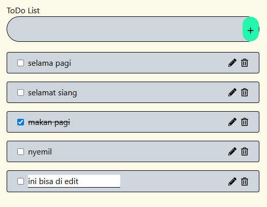

# Aplikasi Todolist

- Aplikasi Todolist sederhana untuk mencatat agenda atau aktivitas harian.

## Teknologin yang digunakan

- React JS
- Tailwind CSS
- Vite
- JavaScript

## feature

- input form dan tombol button + untuk nenambah agenda
- checkbox sebagai penanda sudah di lakukan
- tombol pensil buat mengedit
- tombol gambar sampah untuk menghapus

### Screnshoot todolist

## Cara Menajalanakan Aplikasi

- Clone repositori ini
- buka vscode
- buka vscode di terminal dan jalankan npm install
- jalankan progam npm run dev
- terdapat halaman todolist
- masukan sebuah agenda atau tulisan apapun ke dalam input, dan klik tanda plus di samping kanan, maka agenda akan turun di bawah
- tombol pensil untuk mengedit agenda yang sudah dilakukan
- ketika sudah di lakukan dan ingin menandai saja, makan klik checkbox, makan tulisan akan tercoret
- jika ingin menghapus makan klik tombol gambar sampah
- dan jika ingin menambah agenda lain makan bisa lakukan mengisi input form kembali dan klik tombol button +
- selesai
